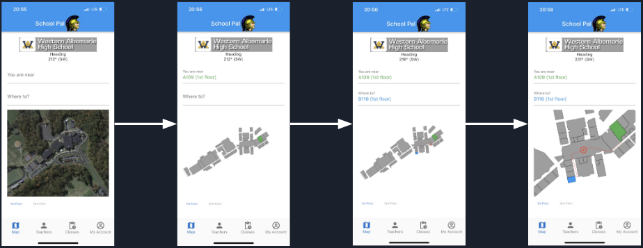

# About Me

Welcome to my page!

My name is Nolan Burkhart, I was born in Kailua, Hawaii and currently reside in Central Virginia.

My main interests are chiefly about Computer Science, however I love the outdoors and all the wilderness that my area has to offer.

I enjoy running all year long, and I am a varsity athlete in Cross Country, Indoor Track, and Outdoor Track. My favorite event by far is the 800m.

*My beautiful little Maltese: Lila*

*My favorite place to be: Monroe, VA*

# My Projects!

## Congressional App Challenge Projects

### SchoolPal

_Winner Congressional App Challenge 2021_

This app, SchoolPal, allows educational systems to become much more organized, friendly to navigate, and pleasant.

Coded in Dart & Flutter, deployable on Web, Desktop, and Mobile platforms.

[Article By The Congressional App Challenge](https://www.congressionalappchallenge.us/21-va05/).

[Find A Demo of SchoolPal Here](./schoolpal/)

### YouthVote

_Runner Up Congressional App Challenge 2020_

[Find A Demo of YouthVote Here](./schoolpal/map)

## Projects For Fun

### HealthFest Generator

A program created to generate schedules for a school event called HealthFest.

Can also be applied to generate schedules for other purposes by tweaking the settings file.

Coded in Python

[Find HealthFest Here](https://github.com/Nolan-Burkhart/HealthFest-Generator)

### Defender Disabler

Have you ever had Windows Defender call a perfectly safe program a random malware name with some random symbols?

Have you ever had Windows Defender try to kill Visual Studio (a windows program) because it thought that the debugger was a piece of malware?

Have you ever had Windows Defender use up 95% of your CPU and freeze your computer because it decided to conduct a random scan?

Probably not, but if you want to get rid of it, this tool will do wonders.

Coded in C++.

[Find Defender Disabler Here](https://github.com/Nolan-Burkhart/defender-disabler)

### Kahoot Flooder

Kahoot, most likely one of the most employed online games used in the classroom. Students join, answer questions, and win based on their speed and accuracy on questions.

Sounds pretty boring.

This bot will utilize WebRequests and disassemble Kahoot's extremely difficult anti-bot challenge just to flood a lobby with random names.

Coded in C++.

[Find Kahoot Flooder Here](https://github.com/Nolan-Burkhart/kahoot-project)
